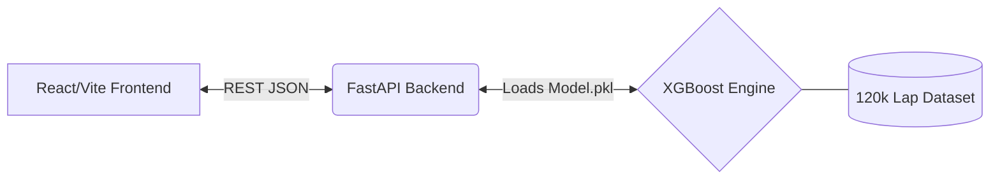

<div align="center">
  

  # 🏎️ F1 Lap Time Simulator
  
  **A full-stack, enterprise-grade machine learning application that predicts live Formula 1 lap times across all circuits using historical data.**

  [](#)
  [](#)
  [](#)
  [](#)

  [Features](#key-features) •
  [Architecture](#system-architecture) •
  [Quick Start](#🚀-quick-start) •
  [The ML Engine](#🧠-the-machine-learning-engine) •
  [Team](#👨‍💻-meet-the-team)
</div>

---

## 🏁 About The Project

The **F1 Lap Time Simulator** is designed to model the extreme complexities of Formula 1 racing dynamics purely from historical race data. Instead of relying on rigid, hardcoded physics engines, this simulator leverages **XGBoost (Extreme Gradient Boosting)** trained on over 120,000 real lap records spanning the 2010–2024 seasons. 

It natively understands non-linear interactions—such as the exact moment a specific tire compound falls off the cliff, or how diminishing fuel weights interact with track evolution over the course of a 70-lap grand prix.

## ✨ Key Features

- **XGBoost Race Prediction Engine:** Capable of predicting continuous lap times with a Mean Absolute Error (MAE) margin of just ~1.5s per lap, scaling intelligently for pit-stop logic.
- **Glassmorphism UI Dashboard:** A fully responsive React frontend heavily utilizing `framer-motion` to recreate the high-tech, data-dense look of an actual F1 pit-wall telemetry monitor.
- **Live Canvas Track Simulation:** An animated top-down canvas simulation that progresses according to the Python backend's lap time computations in real-time.
- **API First:** An ultra-fast Python `FastAPI` service ensuring inferences are calculated and returned in milliseconds.

---

## 🏗️ System Architecture

Our repository is logically segmented into three distinct verticals:



| Component | Technology | Description |
| :--- | :--- | :--- |
| **Frontend UI** | `React`, `Vite`, `Framer Motion` | Renders the telemetry dashboards, configuration limits, and live data charts. |
| **API Gateway** | `FastAPI`, `Uvicorn` | Exposes the `/predict` endpoints, serving inference requests instantly. |
| **Data Engine** | `Pandas`, `NumPy` | Cleans the Ergast Motor Racing API tabular data, building 10+ engineered features. |
| **ML Model** | `XGBoost`, `Scikit-learn` | 400 gradient-boosted decision trees isolating complex race physics. |

---

## 🚀 Quick Start

To run the simulator locally, you need to spin up both the FastAPI backend and the React frontend.

### 1. Start the Machine Learning Backend
```bash
# Navigate to the simulator directory
cd f1_simulator

# Create and activate a Virtual Environment
python -m venv venv
source venv/bin/activate  # (On Windows use: venv\Scripts\activate)

# Install requirements
pip install -r requirements.txt

# Start the FastAPI Server
cd backend
uvicorn main:app --reload --port 8000
```
*The API will boot and hold the `model.pkl` in memory at `http://localhost:8000`.*

### 2. Start the React Frontend
Open a **new/split terminal window**:
```bash
# Navigate to the frontend directory
cd f1-react-app

# Install Node modules
npm install

# Start the Vite development server
npm run dev
```
*The simulator UI is now live! Localhost URL will be provided in your terminal.*

---

## 🧠 The Machine Learning Engine

F1 racing relies on highly non-linear dynamics. Linear models fail to capture these interactions, and standard Neural Networks often catastrophically overfit tabular data. 

**Model Pipeline Features:**
1. **Lap Ratio Normalization:** `<Lap Number> / <Total Laps>` isolates degradation scaling.
2. **Polynomial Tire Wear:** `0.6L + 0.4L²` models the physical "cliff" of tire compounds.
3. **Grid Normalization:** Converts grid positions into a dynamic 0.0 - 1.0 coefficient.
4. **Outlier Filtering:** The pipeline strictly purges Safety Car laps, Red Flags, and DNF anomalies utilizing percentile IQR filters.

> **Dataset:** Sourced directly from the comprehensive [Kaggle F1 World Championship Dataset (Ergast API)](https://www.kaggle.com/datasets/rohanrao/formula-1-world-championship-1950-2020).

---

## 👨‍💻 Meet the Team

<div align="center">
  <table>
    <tr>
      <td align="center">
        <b>Harshil Bhatt</b><br>
        <a href="https://github.com/harsheellhu">
          
        </a>
      </td>
      <td align="center">
        <b>Dhruvya Makadia</b><br>
        <a href="#">
          
        </a>
      </td>
    </tr>
  </table>
  <br>
  <i>Built with ❤️ for F1 Analytics and Artificial Intelligence.</i>
</div>

---

<div align="center">
  <small>&copy; 2024 F1 Simulator Project. Open-sourced under the MIT License.</small>
</div>
